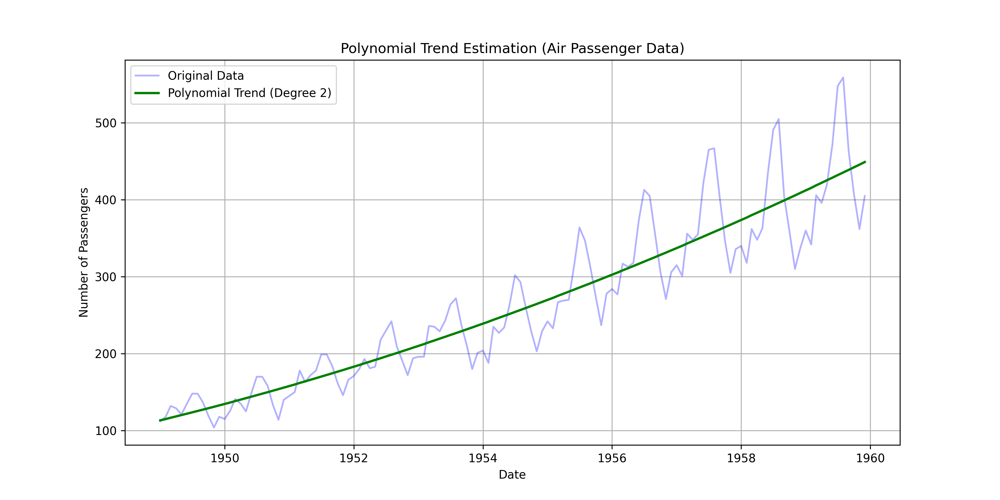

# Ex.No: 02 LINEAR AND POLYNOMIAL TREND ESTIMATION
## Name:NAVEEN KUMAR A
## Reg no:212221240032

## AIM:
To Implement Linear and Polynomial Trend Estiamtion Using Python.

## ALGORITHM:
Import necessary libraries (NumPy, Matplotlib)

Load the dataset

Calculate the linear trend values using least square method

Calculate the polynomial trend values using least square method

End the program

## PROGRAM:
```python
import pandas as pd
import numpy as np
import matplotlib.pyplot as plt

# Load the AirPassenger dataset
file_path = '/mnt/data/AirPassengers.csv'
data = pd.read_csv(file_path)

# Convert 'Month' column to datetime and sort the data
data['Month'] = pd.to_datetime(data['Month'])
data.sort_values('Month', inplace=True)

# Filter data for a specific range (e.g., January 1949 to December 1959)
start_date = '1949-01-01'
end_date = '1959-12-01'
filtered_data = data[(data['Month'] >= start_date) & (data['Month'] <= end_date)]

# Extract date and number of passengers for the filtered range
dates = filtered_data['Month']
passenger_counts = filtered_data['#Passengers']

# Calculate linear trend for the passenger counts
coeffs_linear = np.polyfit(np.arange(len(passenger_counts)), passenger_counts, 1)
linear_trend = np.polyval(coeffs_linear, np.arange(len(passenger_counts)))

# Calculate polynomial trend (degree 2) for the passenger counts
coeffs_poly = np.polyfit(np.arange(len(passenger_counts)), passenger_counts, 2)
poly_trend = np.polyval(coeffs_poly, np.arange(len(passenger_counts)))

# Plotting Linear Trend
plt.figure(figsize=(12, 6))
plt.plot(dates, passenger_counts, color='blue', alpha=0.3, label='Original Data')  # Use transparency
plt.plot(dates, linear_trend, color='red', linewidth=2, label='Linear Trend')
plt.xlabel('Date')
plt.ylabel('Number of Passengers')
plt.title('Linear Trend Estimation (Air Passenger Data)')
plt.legend()
plt.grid(True)
plt.savefig('airpassenger_linear_trend.png', format='png', dpi=300)  # Save the linear trend plot as an image
plt.show()

# Plotting Polynomial Trend
plt.figure(figsize=(12, 6))
plt.plot(dates, passenger_counts, color='blue', alpha=0.3, label='Original Data')  # Use transparency
plt.plot(dates, poly_trend, color='green', linewidth=2, label='Polynomial Trend (Degree 2)')
plt.xlabel('Date')
plt.ylabel('Number of Passengers')
plt.title('Polynomial Trend Estimation (Air Passenger Data)')
plt.legend()
plt.grid(True)
plt.savefig('airpassenger_polynomial_trend.png', format='png', dpi=300)  # Save the polynomial trend plot as an image
plt.show()

```
## OUTPUT


### A - LINEAR TREND ESTIMATION


### B- POLYNOMIAL TREND ESTIMATION


### RESULT:
Thus the python program for linear and Polynomial Trend Estiamtion has been executed successfully.
